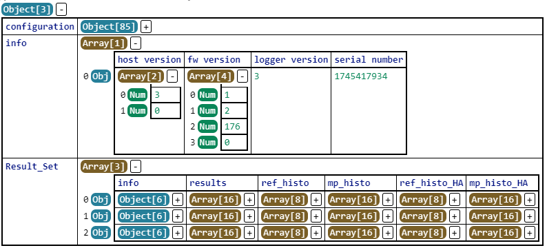
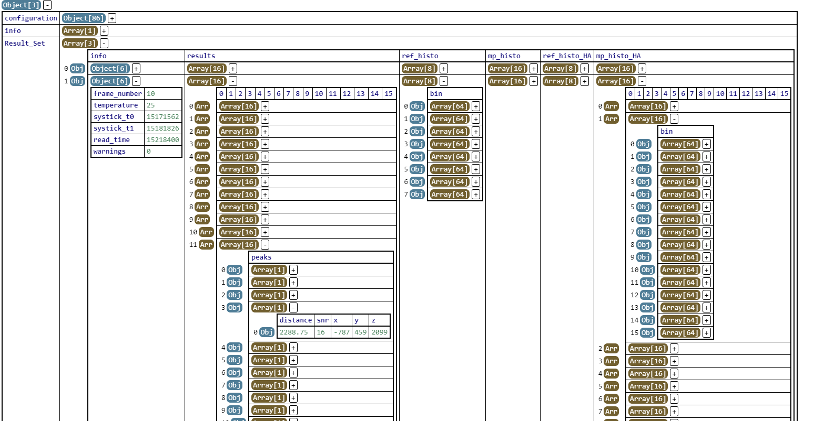

# Overview

This folder contains software for the measurement with the TMF8829 time of flight device.

# Startup

1. Connect the TMF8829 hardware to the PC.
2. Start the ZeroMq server exe - *tmf8829_zeromq_server.exe*.
3. Start the *TMF8829 EVM GUI* or the ZeroMq Client (Logger) *tmf8829_zeromq_client.exe*.
4. The results are graphically represented in the TMF8829 EVM GUI or use the results in the Json output file if the ZeroMq client was used.

Optional: The GUI can be operated in parallel with the ZeroMq client. The configuration is defined by the program, which is started first.

# Configuration

The configuration options for the tmf8829 could be seen in the file tmf8829_config_page.txt.  
The TMF8829 EVM GUI provides only some options for the configuration.

For measurements with the ZeroMq client all device configuration parameters could be changed as well as the number of records.
This changes could be done in the file cfg_client.json.
Device configurations could be changed in "measure_cfg". The parameters must fit to the names in tmf8829_config_page.txt.
Use only valid settings.
Example : period, iterations, histograms

If histogram data should be dumped add the *histograms* parameter:

"measure_cfg": {
        "period":33,
        "iterations": 600,
        ``"histograms":1``
    }

The configuration for different focal plane modes and distances can be done also with recommended settings:
The setting *preconfigure* has the following options:
- CMD_LOAD_CFG_8X8, CMD_LOAD_CFG_8X8_LONG_RANGE, CMD_LOAD_CFG_8X8_HIGH_ACCURACY
- CMD_LOAD_CFG_16X16, CMD_LOAD_CFG_16X16_HIGH_ACCURACY
- CMD_LOAD_CFG_32X32, CMD_LOAD_CFG_32X32_HIGH_ACCURACY
- CMD_LOAD_CFG_48X32, CMD_LOAD_CFG_48X32_HIGH_ACCURACY

The number of measurements is defined in the parameter "record_frames".
The maximum record is limited by the PC memory - e.g. 100 is a recommended value.

# 3D point cloud correction

The results have also 3d point cloud corrected x y z values.
The 3d point cloud correction is sometimes called as flat target correction.

# Output file
The output file name is automatically generated like this:  
``tmf8829_UID<number>-<year>-<month>-<day>-<hour>-<minute>-<second>.json``

The output file contains information about the configuration, information about the used version and result sets.

The result sets have the number of configured results.
A result set contains results, reference pixel histograms, pixel histograms and reference spad results.

## Output file format

The json output file is a hierarchical output of the measurement results and it contain following fields:

- *configuration* - a list of configuration parameters used for the measurement (example: *period* setting)
- *info* - below list of version information
    - *host version* - the EVM version number
    - *fw version* - the firmware version number running on TMF8829
    - *logger version* - logger version number
    - *serial number* - device serial number
- *Result_Set*
    - this is an array of results; the number of elements in this array is defined by *record_frames* from the configuration file
	    - *info* - an array of general information about the result
		    - *frame_number* - the number of the first result frame (one result frame for the fp modes 8x8 and 16x16 and two result frames for the fp modes 32x32 and 48x32)
            - *temperature* - the device temperature of the first result frame
			- *systick_t0* - internal timestamp when t0 integration was started
			- *systick_t1* - internal timestamp when t1 integration was started
			- *warnings* - if there are warnings, the result should not be used.
        - *results* - a two dimensional array of the distance measurement results organized first in rows then in columns (same organization like *mp_hist*)
            - Each element has following information where the format is fixed but individual information is populated depending on the settings inside the config file
                - *noise* - the result from the average noise of this pixel
                - *xtalk* - the crosstalk of this pixel
                - *peaks* - an array of detected distance peaks
                    - *distance* - distance in [mm] in steps of 0.25 mm if config parameter *select*='1' (default) and in bins if *select*='0'
                    - *snr* - signal to noise ratio of this peak
                    - *signal* - signal amplitude
        - *ref_hist* - an array of reference pixel histograms; each sub-measurement outputs four reference histograms. 
                    E.g. 16x16 has two sub-measurements and therefore outputs 8 reference pixel histograms.
                    Only included if *histograms* is set to '1' in the configuration. The number of bins depends on the focal plane mode and
                    8x8 has 256 bins, all other modes have 64 bins.
        - *mp_hist* - a two dimensional array of the histograms organized first in rows then in columns (same organization like *results*)
                    Only included if *histograms* is set to '1' in the configuration. The number of bins depends on the focal plane mode where
                    8x8 has 256 bins and all other modes use 64 bins.
        - *ref_hist_HA* - an array of reference pixel histograms of the high accuracy mode; each sub-measurement outputs four reference histograms. 
                    E.g. 16x16 has two sub-measurements and therefore outputs 8 reference pixel histograms.
                    Only included if *histograms* and *dual_mode* is set to '1' in the configuration. The number of bins depends on the focal plane mode and
                    8x8 has 256 bins, all other modes have 64 bins.
        - *mp_hist_HA* - a two dimensional array of the histograms  of the high accuracy mode organized first in rows then in columns (same organization like *results*)
                    Only included if *histograms* and *dual_mode* is set to '1' in the configuration. The number of bins depends on the focal plane mode where
                    8x8 has 256 bins and all other modes use 64 bins.
                

# Files

- tmf8829_zeromq_server_deployed.exe  
 the ZeroMq server

- tmf8829_zeromq_client_deployed.exe  
the ZeroMq client

- tmf8829_application.hex  
the TMF8829 application patch file

- cfg_server.json  
the tmf8829 device configuration for the zeromq server

- cfg_client.json  
the tmf8829 device configuration for the zeromq client

- TMF8829_EVM_GUI_EvalSW_v<x>-<x>-<x>.exe   
the TMF8829 EVM GUI

- tmf8829_config_page.txt
description for the tmf8829 application configuration
